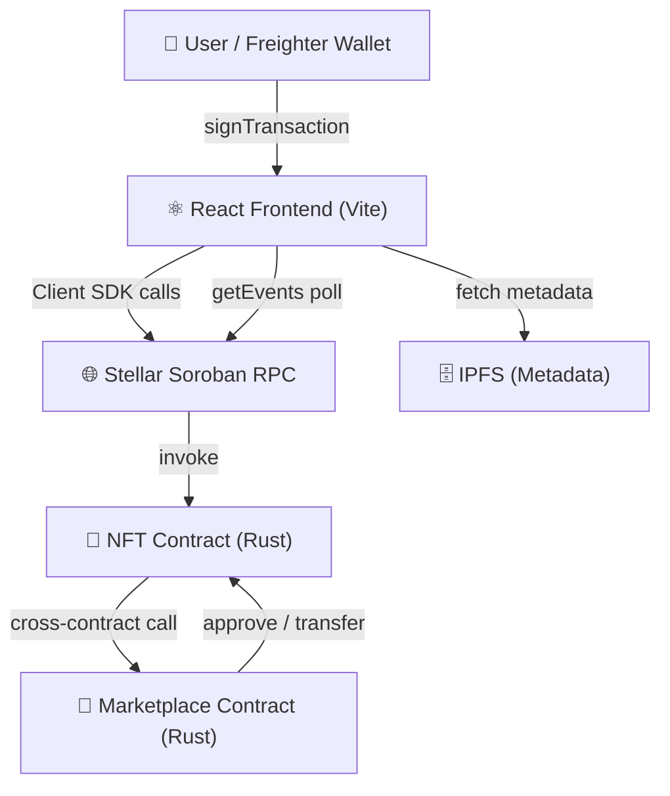

# 🎴 MyEpicNFT-Stellar

---

## ✅ Submission Checklist

- **Public GitHub repository:** [github.com/nandita141/MyEpicNFT-Stellar](https://github.com/nandita141/MyEpicNFT-Stellar)
- **README with complete documentation:** Yes (See below)
- **Minimum 10+ meaningful commits:** Yes
- **Live demo link (Vercel):** [my-epic-nft-stellar-frontend-48b7.vercel.app](https://my-epic-nft-stellar-frontend-48b7.vercel.app/)
- **Contract deployment address:** `CB4T7NWMGPN22AI2GZMPJ4OO4W5UR2JFIE46YQ6AVJ7PEE4Z5LOZFX2H`
- **Transaction hash for contract interaction:** `[Insert Transaction Hash Here]`
- **Screenshot showing Mobile responsive UI:** 
  *(Replace with actual screenshot)*
  ``
- **Screenshot showing CI/CD pipeline running:** 
  *(Replace with actual screenshot)*
  ``
- **Screenshot showing Test output with 3+ passing tests:** 
  *(Replace with actual screenshot)*
  ``
- **Demo video link (1–2 minutes):** [Watch the Demo](https://drive.google.com/file/d/1Xkpl9Ls5iMyuafxIwtyEXzn8LPR3ZIYO/view?usp=sharing)

---[](https://github.com/nandita141/MyEpicNFT-Stellar/actions)
[](https://stellar.org)
[](https://soroban.stellar.org)
[](https://reactjs.org)
[](https://opensource.org/licenses/ISC)

**MyEpicNFT-Stellar** is a production-ready, full-stack NFT collectible card game built on the **Stellar/Soroban** ecosystem. It features an advanced Rust smart contract with inter-contract marketplace communication, a mobile-responsive React dashboard with real-time event streaming, comprehensive tests, and a CI/CD pipeline.

---

## 📺 Project Demo


### 🔗 [Watch the working Demo here](https://drive.google.com/file/d/1Xkpl9Ls5iMyuafxIwtyEXzn8LPR3ZIYO/view?usp=sharing)

### 🚀 [Live App on Vercel](https://my-epic-nft-stellar-frontend-48b7.vercel.app)
---
#images/


## ✨ Key Features

| Feature | Description |
|---|---|
| 🚀 **Instant Minting** | Public mint with randomized card assignment |
| 🛡️ **Admin Controls** | Admin mint for specific URIs |
| 🔥 **Burn** | Owners can permanently destroy cards |
| ✅ **Approve / Delegate** | Approve a spender for marketplace use |
| 🏪 **Marketplace Contract** | Inter-contract cross-call for buying/selling cards |
| 📡 **Event Streaming** | Real-time contract event log polled from Stellar RPC |
| 📊 **Interactive Dashboard** | Real-time stats, contract overview, token query |
| 🃏 **My Collection** | 3D flip-card gallery of all owned NFTs |
| 🔁 **Asset Transfer** | Secure peer-to-peer transfers from the UI |
| 💎 **Responsive UI** | Mobile-first glassmorphism design with dark/light mode |
| 🧪 **Full Test Suite** | Rust integration tests + Vitest frontend tests |
| 🔄 **CI/CD** | GitHub Actions: test + build + Vercel deploy |

---

## 🏗️ Architecture



---

## 🛠️ Tech Stack

| Layer | Technology |
|---|---|
| Smart Contract | Soroban SDK (Rust) |
| Inter-contract | Soroban `contractclient` macro |
| Frontend | React 18 + Vite |
| Styling | Vanilla CSS (glassmorphism, responsive) |
| Wallet | Freighter Wallet API |
| Metadata | IPFS |
| Blockchain | Stellar Testnet |
| Tests | `cargo test` (Rust) + Vitest (React) |
| CI/CD | GitHub Actions + Vercel |

---

## 📄 Contract API Reference

### NFT Contract — `CB4T7NWMGPN22AI2GZMPJ4OO4W5UR2JFIE46YQ6AVJ7PEE4Z5LOZFX2H`

#### Write Functions (require wallet signature)

| Function | Arguments | Returns | Description |
|---|---|---|---|
| `initialize` | `admin: Address` | — | One-time setup. Sets admin. |
| `admin_mint` | `to: Address, uri: String` | `u64` (token ID) | Admin mints specific card. |
| `public_mint` | `to: Address` | `u64` (token ID) | Anyone mints a random card. |
| `transfer` | `from, to: Address, token_id: u64` | — | Transfer card ownership. |
| `burn` | `owner: Address, token_id: u64` | — | Permanently destroy a card. |
| `approve` | `owner, spender: Address, token_id: u64` | — | Delegate transfer to spender. |

#### Read-Only Functions (free, no signature)

| Function | Arguments | Returns | Description |
|---|---|---|---|
| `total_supply` | — | `u64` | Total cards ever minted. |
| `owner_of` | `token_id: u64` | `Address` | Get owner of a token. |
| `token_uri` | `token_id: u64` | `String` | Get metadata URI. |
| `is_burned` | `token_id: u64` | `bool` | Check if token was burned. |
| `get_approved` | `token_id: u64` | `Option<Address>` | Get approved spender. |
| `get_card_info` | `token_id: u64` | `CardInfo` | Batch: owner + uri + burned. |

#### Contract Events

| Event | Topics | Data |
|---|---|---|
| `mint` | `("mint", to)` | `token_id: u64` |
| `transfer` | `("transfer", from, to)` | `token_id: u64` |
| `burn` | `("burn", owner)` | `token_id: u64` |
| `approve` | `("approve", owner, spender)` | `token_id: u64` |

### Marketplace Contract (Inter-Contract)

| Function | Description |
|---|---|
| `initialize(admin, nft_contract)` | Setup marketplace with NFT contract address |
| `list_card(seller, token_id, price_stroops)` | List card for sale (calls NFT `approve`) |
| `buy_card(buyer, token_id, xlm_token)` | Buy card — transfers XLM + calls NFT `transfer` |
| `cancel_listing(seller, token_id)` | Delist a card |
| `get_listing(token_id)` | Read listing details |

---

## 🚀 Getting Started

### Prerequisites
- [Stellar CLI](https://developers.stellar.org/docs/tools/stellar-cli)
- [Rust + Cargo](https://www.rust-lang.org/tools/install) with `wasm32v1-none` target
- [Node.js v18+](https://nodejs.org/) & `pnpm`
- [Freighter Wallet](https://freighter.app/) extension

### 1. Smart Contract — Build & Test
```bash
cd StellarCard/contracts

# Run all integration tests
cargo test --features testutils

# Build WASM
stellar contract build
```

### 2. Frontend — Install & Run
```bash
cd StellarCard/frontend

# Copy env vars
cp .env.example .env
# Edit .env with your contract ID

pnpm install
pnpm dev
```

### 3. Frontend Tests
```bash
cd StellarCard/frontend
pnpm test          # watch mode
pnpm test:run      # single run (for CI)
```

### 4. Deployment
The frontend deploys automatically to **Vercel** on push to `main` via GitHub Actions.

Required GitHub Secrets:
- `VERCEL_TOKEN` — from Vercel dashboard
- `VITE_CONTRACT_ID` — your deployed contract ID

---

## 📦 Project Structure

```
StellarCard/
├── .github/
│   └── workflows/
│       └── ci.yml              # CI/CD: test + build + deploy
├── contracts/
│   └── src/
│       ├── lib.rs              # NFT contract (events, burn, approve)
│       ├── nft_card.rs         # DataKey & CardInfo types
│       ├── marketplace.rs      # Inter-contract marketplace
│       └── tests.rs            # 10 Rust integration tests
├── frontend/
│   ├── src/
│   │   ├── components/         # Sidebar, Header, Dashboard, Cards, ...
│   │   ├── context/            # AppContext (wallet, toasts, theme)
│   │   ├── hooks/              # useContract, useEventStream
│   │   ├── tests/              # Vitest unit tests
│   │   ├── config.js           # Centralized env config
│   │   └── App.jsx             # Slim orchestrator
│   ├── .env.example
│   └── vite.config.js
├── packages/stellar_card/      # Contract client SDK
└── scripts/                    # Deploy & mint .bat scripts
```

---

## 🤝 Contributing
Contributions are welcome! Feel free to open an issue or submit a pull request.

## 📄 License
Licensed under the **ISC License**.

## 👤 Author
**Nandita**
- GitHub: [@nandita141](https://github.com/nandita141)
- Live App: [Vercel Deploy](https://my-epic-nft-stellar-frontend-48b7.vercel.app)

## 📚 Resources
- [Stellar Documentation](https://developers.stellar.org/)
- [Soroban Documentation](https://soroban.stellar.org/docs)
- [Freighter Wallet](https://freighter.app/)
- [Stellar Expert](https://stellar.expert/)
